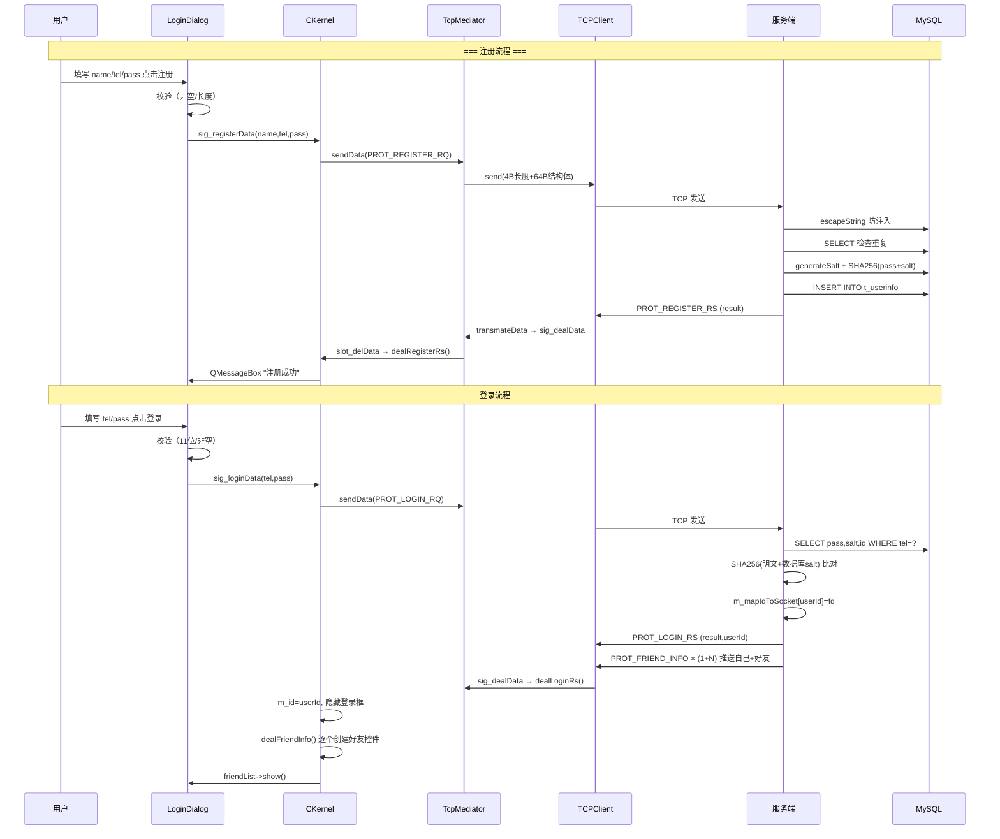
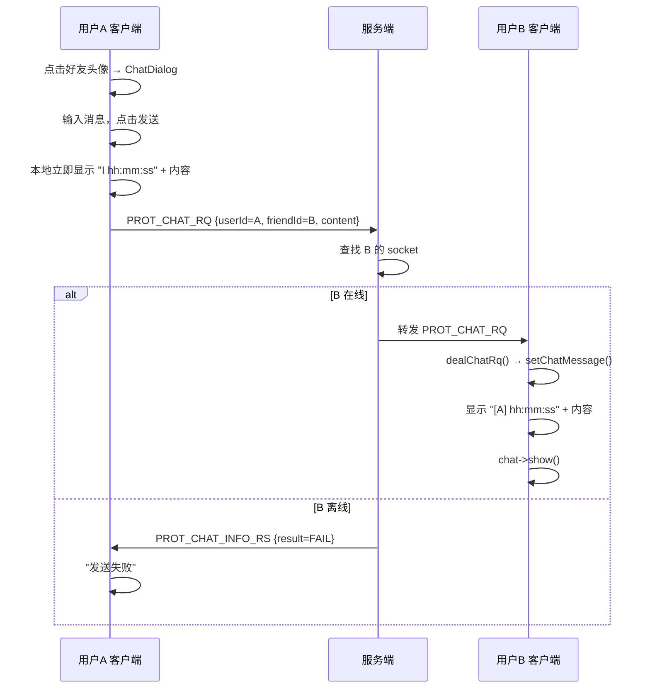
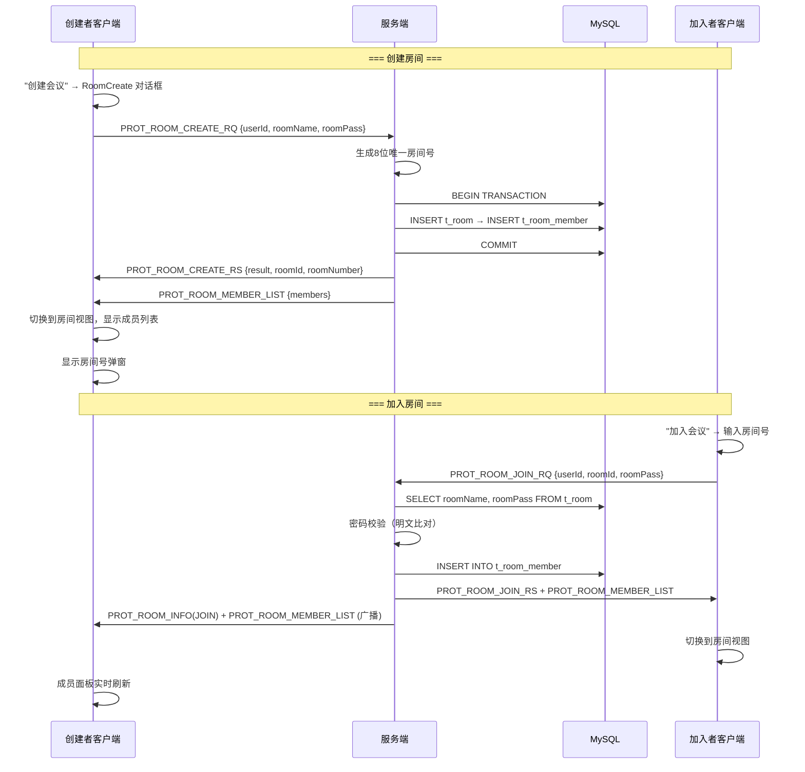
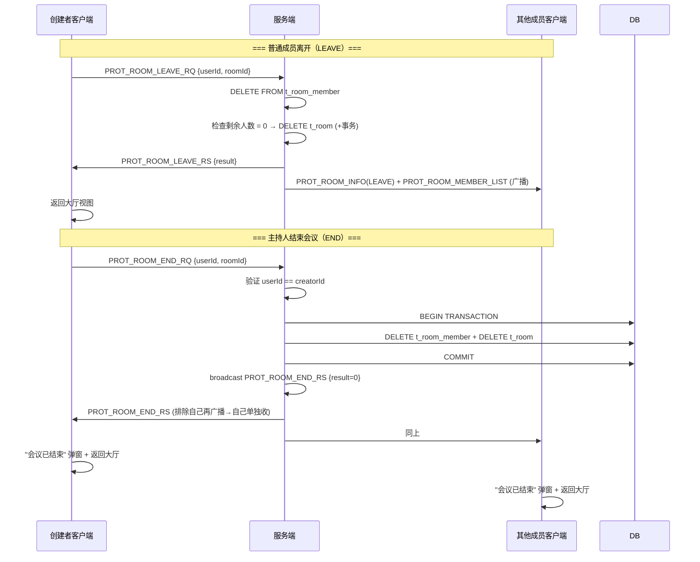
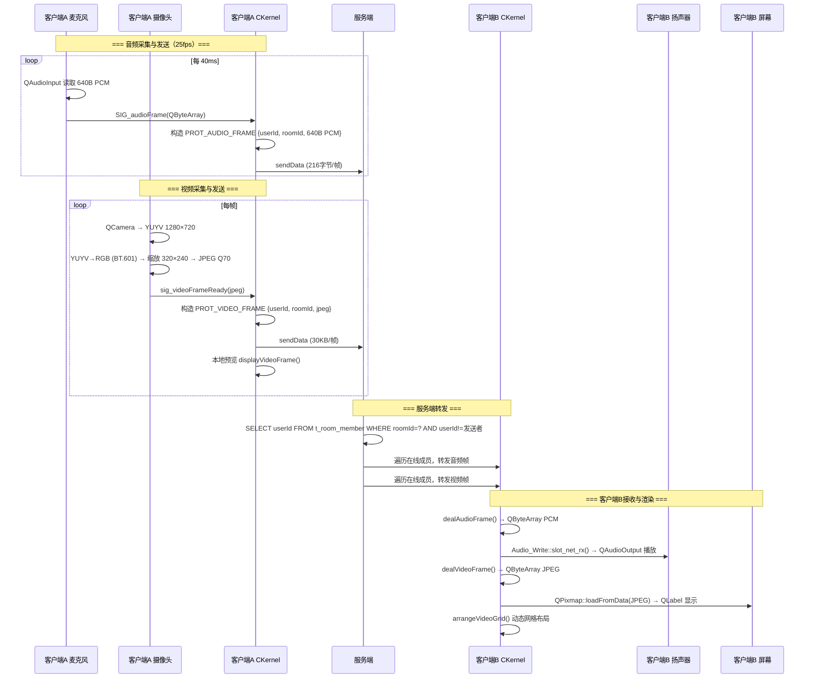

# IM 即时通讯系统 — 阶段性总结报告

> 报告日期：2026-05-19  
> 当前版本：v1.0-beta  
> 覆盖范围：基础聊天 + 房间会议 + 音视频初版

---

## 一、技术栈

### 1.1 客户端（Windows 11）

| 层级 | 技术 | 说明 |
|------|------|------|
| UI 框架 | Qt 5.15.2 (Widgets) | 信号/槽驱动，QSS 样式表（909行深色主题） |
| 编译器 | MinGW 8.1.0 64-bit | gcc/g++ 8.1.0 |
| 网络 | Winsock2 | 原始 Berkeley Socket API |
| 音频采集/播放 | Qt Multimedia (QAudioInput/QAudioOutput) | 8kHz, 16-bit, mono PCM |
| 视频采集 | Qt Multimedia (QCamera/QVideoProbe) | YUYV 1280×720 → RGB → JPEG 320×240 Q70 |
| 屏幕共享 | QScreen::grabWindow | JPEG 960×540 Q50 |
| 构建系统 | qmake | IMClient.pro |

### 1.2 服务端（Linux VM Ubuntu 22.04）

| 层级 | 技术 | 说明 |
|------|------|------|
| 语言/编译器 | C++ / g++ | 标准 C++98/03 风格 |
| 网络模型 | Epoll (ET边缘触发) + EPOLLONESHOT | 单线程事件循环，非阻塞 I/O |
| 线程池 | pthread 自实现 | min=10, max=100, queue=1000, 2s 自适应调容 |
| 数据库 | MySQL 5.7 (utf8mb4) | mysqlclient C API + 预编译语句 |
| 密码哈希 | SHA256 + 32-char hex salt | OpenSSL libcrypto |
| 构建系统 | Makefile | g++ 直接编译 |

### 1.3 通信协议

| 项目 | 规格 |
|------|------|
| 传输协议 | TCP |
| 端口 | 6789 |
| 帧格式 | `[4字节 int 载荷长度][N字节载荷]` |
| 分发机制 | 函数指针表（基址1000，26个槽位） |
| 编码 | 网络层 GB2312 ↔ 客户端 UTF-8 ↔ 数据库 utf8mb4 |

---

## 二、数据传输过程

### 2.1 发送链路

```
UI 层 (QWidget)
  │  用户操作触发
  │  emit sig_xxxData(...)
  ▼
CKernel（控制层）
  │  槽函数接收信号
  │  构造 PROT_XXX_RQ 结构体（构造函数自动填充 packtype）
  │  编码转换：UTF-8 → GB2312（Utf8Togb2312）
  │  调用 m_pMediator->sendData((char*)&rq, sizeof(rq), to)
  ▼
TcpClientMediator（中介层）
  │  透明转发给 TCPClient
  │  如连接断开则自动重连
  ▼
TCPClient（网络层）
  │  send(4字节帧长度)
  │  send(N字节结构体数据)
  ▼
TCP Socket → 192.168.134.128:6789
```

### 2.2 接收链路

```
TCP Socket ← 服务端 TCP 发送
  │
TCPClient::recvData()（独立线程）
  │  recv(4字节) → nPackLen
  │  new char[nPackLen]
  │  循环 recv() 直到收满 nPackLen 字节
  │  m_pMediator->transmateData(packBuf, packLen, sock)
  ▼
TcpClientMediator
  │  emit sig_dealData(data, len, from)
  │  ★ 跨线程：recv线程 → Qt主线程（信号槽自动排队）
  ▼
CKernel::slot_delData()（Qt 主线程）
  │  packageType type = *(packageType*)data   // 读前4字节
  │  int index = type - 1000                   // 计算索引
  │  PFUN pf = m_protocol[index]              // 查函数指针表
  │  (this->*pf)(data, len, from)             // 调用处理器
  │  delete[] data                             // 释放缓冲区
  ▼
具体处理函数（dealXxxRs / dealXxxRq）
  │  拆包取字段
  │  编码转换：GB2312 → UTF-8（gb2312ToUtf8）
  │  更新 UI / 发射信号
```

### 2.3 协议分发机制

```
协议号 → 索引计算 → 函数指针查表 → 调用

示例：
  1001(REGISTER_RS) → index=1  → m_protocol[1]  → dealRegisterRs()
  1003(LOGIN_RS)     → index=3  → m_protocol[3]  → dealLoginRs()
  1010(FRIEND_INFO)  → index=10 → m_protocol[10] → dealFriendInfo()
  1012(CREATE_RS)    → index=12 → m_protocol[12] → dealRoomCreateRs()
  1024(MEMBER_LIST)  → index=24 → m_protocol[24] → dealRoomMemberList()
```

---

## 三、核心时序图

### 3.1 注册与登录



### 3.2 1v1 聊天



### 3.3 房间创建与加入



### 3.4 房间离开与结束



### 3.5 音视频推流（当前 PCM + JPEG 方案）



---

## 四、项目流程

### 4.1 整体开发流程

```
Phase 0: 基础设施搭建
  ├─ 服务端 TCP Epoll + 线程池
  ├─ 客户端 Winsock2 TCP + 3层架构
  ├─ 协议帧格式定义
  └─ MySQL 数据库建表

Phase 1: 用户与好友系统 ✅
  ├─ 注册（SHA256+盐值）
  ├─ 登录（重复登录检测）
  ├─ 添加好友（在线转发/离线通知）
  ├─ 1v1 文字聊天
  └─ 朋友上线/下线通知

Phase 2: 房间（会议）系统 ✅
  ├─ 创建房间（8位房间号，事务保护）
  ├─ 加入房间（roomId/roomNumber 两级查找）
  ├─ 离开房间（空房自动销毁）
  ├─ 结束会议（仅主持人，事务删除）
  ├─ 房间聊天（全成员广播）
  ├─ 成员列表（实时推送 + 5s 轮询兜底）
  └─ 会议大厅（已加入/已创建房间卡片）

Phase 3: 音视频初版 ✅ (当前阶段)
  ├─ 音频采集/播放（PCM 8kHz 16-bit）
  ├─ 视频采集/显示（YUYV→RGB→JPEG）
  ├─ 屏幕共享（960×540 JPEG Q50）
  ├─ 双视频网格 + 画中画
  ├─ 麦克风/摄像头开关
  └─ 空帧通知摄像头关闭

Phase 4: 音视频升级 🔜 (规划中)
  ├─ FFmpeg H.264/AAC 编解码
  ├─ UDP + RTP 传输
  ├─ OpenGL 视频渲染
  └─ 推流录制
```

### 4.2 客户端启动流程

```
main.cpp
  QApplication 创建
  ├─ 加载 style.qss（全局深色主题）
  └─ CKernel 构造：
      ├─ setProtocol() — 初始化 m_protocol[26] 函数指针表
      ├─ new QTimer(5s)  — 房间轮询定时器
      ├─ new friendList   — 主窗口（隐藏）,"会议"/"聊天"双标签
      ├─ new LoginDialog  — 登录窗口
      ├─ show()           — 显示登录窗口
      ├─ connect() × 11   — 绑定所有 UI 信号→Kernel 槽
      ├─ new TcpClientMediator — 内部创建 TCPClient
      ├─ connect sig_dealData  — 绑定数据接收分发
      └─ openNet()        — WSAStartup+socket+connect(192.168.134.128:6789)
```

### 4.3 服务端启动流程

```
main.cpp
  CKernel 构造：
  ├─ setProtocol() — 初始化 m_protocol[26] 函数指针表
  └─ startServer()
      └─ TcpServer::initNet()
          ├─ epoll_create(10000)
          ├─ bind(0.0.0.0:6789), SO_REUSEADDR
          ├─ pthread_create × 10 (初始工作线程)
          ├─ pthread_create manager线程 (2s调容)
          └─ startRecv() — QThread 运行 epoll_wait 循环
```

---

## 五、已实现功能

### 5.1 用户系统

| 功能 | 状态 | 说明 |
|------|------|------|
| 用户注册 | ✅ | SHA256 + 32char hex salt 密码存储 |
| 用户登录 | ✅ | 重复登录检测（拒绝新连接，保留旧连接） |
| 用户退出 | ✅ | 通知在线好友 + 清理 socket 映射 + 清理创建的房间 |
| 个人资料展示 | ✅ | 昵称、头像(36选1)、心情签名 |

### 5.2 好友系统

| 功能 | 状态 | 说明 |
|------|------|------|
| 添加好友 | ✅ | 在线：转发请求→确认→双向存储；离线：通知失败 |
| 好友列表 | ✅ | 在线/离线状态实时更新，头像变灰 |
| 1v1 文字聊天 | ✅ | HTML 格式，在线转发/离线丢弃 |
| 上线/下线通知 | ✅ | 服务端推送 FRIEND_INFO/OFFLINE 给好友 |

### 5.3 房间系统（14 个协议：1011-1024）

| 功能 | 协议 | 状态 | 说明 |
|------|------|------|------|
| 创建房间 | 1011-1012 | ✅ | 8位随机唯一房间号，事务保护 INSERT |
| 加入房间 | 1013-1014 | ✅ | 支持 roomId/roomNumber 两级查找，密码校验，幂等加入 |
| 离开房间 | 1015-1016 | ✅ | 空房间自动销毁（事务 DELETE），剩余房间保留 |
| 结束会议 | 1022-1023 | ✅ | 仅主持人可操作，权限校验，事务删除，全员广播 |
| 房间聊天 | 1017-1018 | ✅ | 成员校验，全成员广播（含发送者），未在房间时缓存消息 |
| 房间列表 | 1019-1020 | ✅ | 返回可见房间（已加入/已创建/未移除） |
| 房间信息广播 | 1021 | ✅ | JOIN/LEAVE 事件推送给剩余成员 |
| 成员列表 | 1024 | ✅ | 创建/加入/离开时服务端广播，客户端 5s 轮询兜底 |

### 5.4 UI 系统

| 功能 | 状态 | 说明 |
|------|------|------|
| 登录/注册界面 | ✅ | 双标签，表单校验 |
| 好友列表窗口 | ✅ | "会议"/"聊天" 双标签页 |
| 好友组件 | ✅ | 头像+昵称+心情+状态，点击打开聊天 |
| 1v1 聊天对话框 | ✅ | QTextBrowser 显示，支持 HTML |
| 房间创建对话框 | ✅ | Modal，房间名+密码 |
| 房间大厅 | ✅ | 房间卡片（房间名、人数、房间号） |
| 房间视图 | ✅ | 左侧视频网格 + 右侧成员/聊天面板 |
| 深色主题 | ✅ | style.qss（909行），视频会议风格 |
| 可折叠面板 | ✅ | 成员面板/聊天面板可折叠 |

### 5.5 音视频（初版）

| 功能 | 状态 | 说明 |
|------|------|------|
| 音频采集 | ✅ | QAudioInput, 8kHz 16-bit mono PCM, 40ms/帧(640B) |
| 音频播放 | ✅ | QAudioOutput, PCM 直写播放 |
| 视频采集 | ✅ | QCamera+QVideoProbe, YUYV→RGB(BT.601)→JPEG Q70 |
| 视频显示 | ✅ | QPixmap JPEG解码→QLabel, 320×240 |
| 屏幕共享 | ✅ | QScreen::grabWindow, 960×540 JPEG Q50 |
| 视频网格 | ✅ | 动态 1×1/1×2/2×2/2×3/3×3 布局 |
| 画中画(PIP) | ✅ | 屏幕+摄像头同时开→摄像头 PIP 右上角 |
| 全屏+小窗 | ✅ | 点击放大成员，右上角 240×160 小窗 |
| 麦克风开关 | ✅ | 底栏按钮，默认关闭 |
| 摄像头开关 | ✅ | 底栏按钮，空帧(frameSize=0)通知成员 |
| 主持人默认显示 | ✅ | 入会自动放大主持人画面 |

---

## 六、未实现功能

### 6.1 P0 — 高优先级（影响核心稳定性）

| # | 功能 | 现状 | 影响 |
|---|------|------|------|
| P0-1 | 心跳/断线重连 | TCP 半开连接无检测，断开无自动恢复 | 网络波动导致功能失效 |
| P0-2 | 协议版本协商 | def.h 手动同步，单边修改即通信错乱 | 版本不匹配无提示直接崩溃 |

### 6.2 P1 — 中优先级（影响用户体验）

| # | 功能 | 现状 | 影响 |
|---|------|------|------|
| P1-1 | sendData 返回值检查 | 除登录外所有发送不检查结果 | TCP 断开发送失败无感知 |
| P1-2 | 成员列表分页 | 50人硬上限，无分页 | 大型会议室不可用 |
| P1-3 | ROOM_LIST 权限过滤 | 返回所有房间信息 | 泄露房间存在性 |
| P1-4 | 离线消息存储 | 对方离线直接丢弃消息 | 消息不可达 |
| P1-5 | 成员在线状态 | members.status 恒为0 | 成员列表无法区分在线/离线 |
| P1-6 | 房间密码修改 | 创建后密码不可改 | 安全性不足 |

### 6.3 P2 — 低优先级（代码质量）

| # | 问题 | 说明 |
|---|------|------|
| P2-1 | 无日志系统 | 仅 qDebug()，无分级/文件/滚动 |
| P2-2 | 无配置文件 | IP/端口/DB密码全部硬编码 |
| P2-3 | 无单元测试 | 纯手工测试 |
| P2-4 | 无 CI/CD | 无自动化构建 |
| P2-5 | 房间密码明文存储 | t_room.roomPass 不哈希 |
| P2-6 | rand() 未播种 | 房间号生成用 rand() 但无 srand() |
| P2-7 | 双重 recv 实现 | TcpServer 中存在两套 recv 逻辑 |
| P2-8 | 死代码 | RoomList/RoomChat 编译但不实例化 |
| P2-9 | 命名不一致 | CKernel(大驼峰) vs friendList(小驼峰) |
| P2-10 | 联系人白板 | m_pContactsLayout 创建但从未填充 |

### 6.4 Phase 2 — 音视频升级（FFmpeg 方案，未实现）

| 模块 | 当前方案 | 目标方案 | 预估难度 |
|------|----------|----------|----------|
| 音频编码 | 无（PCM 128kbps） | FFmpeg AAC (~32kbps) | 🟡 中 |
| 音频解码 | 无（直写PCM） | FFmpeg AAC | 🟡 中 |
| 音频播放 | QAudioOutput | SDL2 低延迟播放 | 🟡 中 |
| 视频编码 | JPEG Q70 (~1.2Mbps) | FFmpeg H.264 (~200kbps) | 🔴 大 |
| 视频解码 | QPixmap JPEG(CPU) | FFmpeg H.264 硬解 | 🔴 大 |
| 视频渲染 | QLabel QPixmap(CPU) | OpenGL GPU 纹理渲染 | 🟡 中 |
| 视频采集 | QCamera+QVideoProbe | OpenCV VideoCapture | 🟡 中 |
| 网络传输 | TCP 全量 struct | UDP + RTP 分片 | 🟡 中 |
| 双设备混音 | 无 | 麦克风+系统音混音 | 🟡 中 |
| 推流录制 | 无 | FFmpeg MP4/FLV 封装 | 🔴 大 |

**关键依赖**：需重编译 FFmpeg/SDL2/OpenCV/libx264/libfdk-aac 为 64 位 MinGW 兼容版本。

### 6.5 Phase 3 — 系统增强（远期规划，未实现）

- 文件传输（1v1 和房间内）
- 聊天消息持久化（t_room_message 表已创建但未使用）
- 离线消息队列（上线后拉取未读）
- 消息已读回执
- 用户头像自定义上传
- 多设备同时登录
- Web 管理后台
- Docker 容器化部署
- Android 客户端（Qt for Android）

---

## 七、协议总览

### 7.1 完整协议清单（26 个槽位，22 个已使用）

```
1000 REGISTER_RQ       C→S   注册请求
1001 REGISTER_RS       S→C   注册回复
1002 LOGIN_RQ          C→S   登录请求
1003 LOGIN_RS          S→C   登录回复
1004 —                 未使用
1005 CHATMSG_RQ        双向   1v1 聊天请求
1006 CHATMSG_RS        S→C   1v1 聊天回复
1007 ADD_FRIEND_RQ     双向   添加好友请求
1008 ADD_FRIEND_RS     双向   添加好友回复
1009 FRIEND_OFFLINE    双向   下线通知
1010 FRIEND_INFO       S→C   好友信息推送
1011 ROOM_CREATE_RQ    C→S   创建房间请求
1012 ROOM_CREATE_RS    S→C   创建房间回复
1013 ROOM_JOIN_RQ      C→S   加入房间请求
1014 ROOM_JOIN_RS      S→C   加入房间回复
1015 ROOM_LEAVE_RQ     C→S   离开房间请求
1016 ROOM_LEAVE_RS     S→C   离开房间回复
1017 ROOM_CHAT_RQ      C→S   房间聊天请求
1018 ROOM_CHAT_RS      S→C   房间聊天广播
1019 ROOM_LIST_RQ      C→S   房间列表请求
1020 ROOM_LIST_RS      S→C   房间列表回复
1021 ROOM_INFO         S→C   房间信息广播 (JOIN/LEAVE)
1022 ROOM_END_RQ       C→S   结束会议请求
1023 ROOM_END_RS       S→C   结束会议广播
1024 MEMBER_LIST       S→C   成员列表推送
1025 AUDIO_FRAME       双向   音频帧 (PCM 640B)
1026 VIDEO_FRAME       双向   视频帧 (JPEG ~30KB)
```

### 7.2 编码路径

```
客户端输入 (QString UTF-16)
  ├─ 注册/登录: .toStdString() → UTF-8 字节 → strcpy_s
  ├─ 添加好友: .toStdString() → UTF-8 字节 → strcpy_s (已统一为UTF-8)
  └─ 房间操作: Utf8Togb2312() → GB2312 字节 → memcpy
         ↓
    网络传输 (GB2312 或 UTF-8，视协议而定)
         ↓
服务端接收
  ├─ dealRegisterRq: mysql_real_escape_string → INSERT utf8mb4
  ├─ dealLoginRq: SELECT → 重新哈希比对
  └─ getInfoById: 读 UTF-8 → QTextCodec GB2312 → FRIEND_INFO
         ↓
客户端接收: gb2312ToUtf8() → QString → UI 显示
```

---

## 八、服务端关键数据结构

| 结构 | 类型 | 用途 |
|------|------|------|
| m_mapIdToSocket | QMap<int,int> | userId → socket fd（受 QMutex 保护） |
| m_mapSocketToId | QMap<int,int> | socket fd → userId |
| m_mapIdToRoom | QMap<int,set<int>> | userId → 已加入的 roomId 集合 |
| m_protocol[26] | PFUN 数组 | 协议号→处理函数分发 |

---

## 九、构建与部署

### 客户端（Windows）
```bash
# 推荐：Qt Creator 打开 IMClient.pro → 构建
E:\Qt\5.15.2\mingw81_64\bin\qmake.exe IMClient.pro
mingw32-make -j4 CC="E:/Qt/Tools/mingw810_64/bin/gcc" CXX="E:/Qt/Tools/mingw810_64/bin/g++"
# 输出：release/IMClient.exe 或 debug/IMClient.exe
```

### 服务端（Linux）
```bash
ssh mkbk@192.168.134.128
cd /home/mkbk/colin/im_server_linux/
make -j4                          # 编译
fuser -k 6789/tcp                 # 停止服务
nohup ./bin/im_server > /tmp/im_server.log 2>&1 &  # 启动
```

---

## 十、已知重大问题速查

| # | 问题 | 状态 |
|---|------|------|
| 1 | 无心跳/断线重连 | ⚪ 待实现 |
| 2 | 协议无版本协商 | ⚪ 待实现 |
| 3 | sendData 返回值被忽略 | ⚪ 待修复 |
| 4 | 离线消息直接丢弃 | ⚪ 待实现 |
| 5 | 房间密码明文存储 | ⚪ 待修复 |
| 6 | 服务端 usename 拼写错误 | ⚪ 待修复 |

---

> **全文统计**：26 个协议槽位，22 个已实现；14 个源文件；服务器 ckernel.cpp 1175 行；客户端 ckernel.cpp ~1300 行；累计修复 20 个问题。
